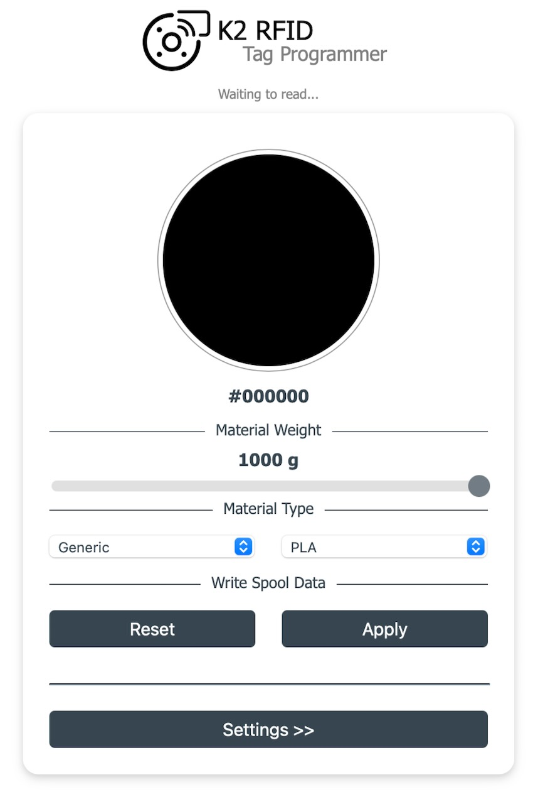
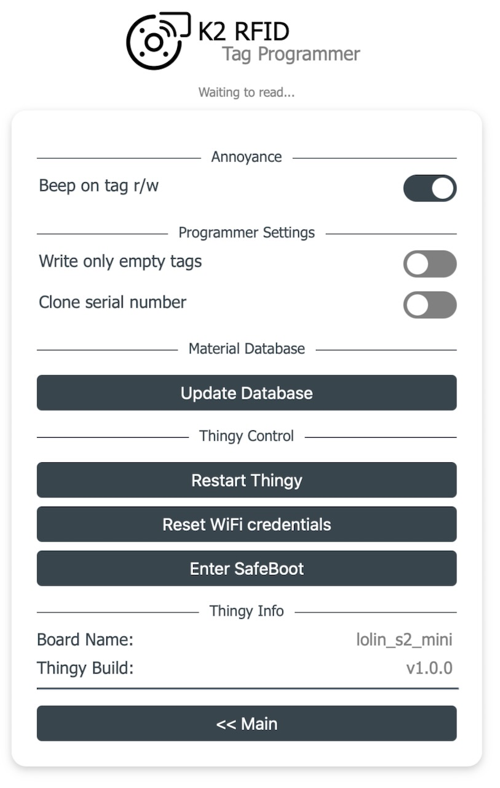
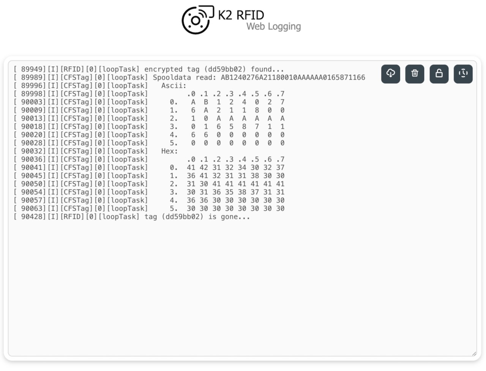
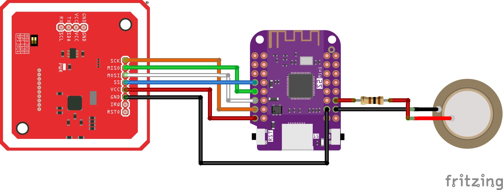
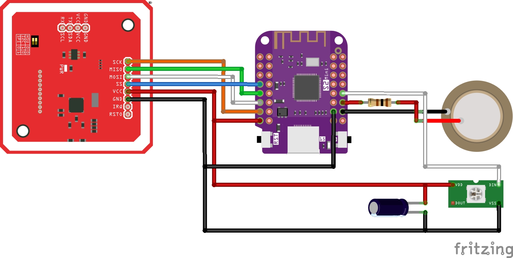

# K2-RFID
 
Web app controlled and esp32-powered K2/CFS RFID programming thingy based on [DnG-Crafts/K2-RFID](https://github.com/DnG-Crafts/K2-RFID).

## Why do I need it?

Creality's K2 Plus printer supports 1k MIFARE tags to identify the spool's material and color.
As the tagged spools from Creality come with an additional price and also to retrofit older Creality or non-Creality spools, you could use this tool to simply write your own tags, add two of them per spool and enjoy the magic of automatically identified materials.

## What do I need to make one?

- esp32 microcontroller (tested with a [Wemos S2 mini board](https://www.wemos.cc/en/latest/s2/s2_mini.html))
- PN532 NFC/RFID board
- MIFARE classic 1k tags
- optionally
  - housing
  - WS2812b RGB LED (and ~1µF capacitor)
  - piezo disk (and ~100 Ohm resistor)
  - very optionally
    - battery
    - charger
    - switch

## How to use it?

Once you have programmed your esp32, connected it to the PN532 NFC/RFID board, and supplied it with power, a new access point (with SSID: K2RFID) will appear on your computer or phone. Set the WiFi credentials for your home network (or set it to AP-mode). After a restart of the device, just visit K2RFID.local. Here you can read and write the tags. Afterwards just put two of them (obviously with identical content) to a spool and load it into your printer's CFS.

### Select Material Settings via UI

Just select the color by hitting the large color circle to select the color of choice (or select one the the known - at least known to me - standard colors), the type of material and the amount of material on the spool. After hitting the `Apply` button, the programmer is armed and will wait for tags to write the content. A serial number is auto-generated and will be used for all subsequent writes. A new serial number is genereted whenever you hit the `Apply` button again.

    

### Copy/Clone Tag

Once a tag is read, just click the toast notification and it will make the content (color, material, weight, and serial number - in case `clone serial number` is active in the settings) of the tag available for writing. Just hit the `Apply` button to arm the programmer.

### Safeguarding existing Tags

By default, only empty tags are written. When you want to re-program tags, disable the `Write only empty tags` checkbox in the settings.

### Future Materials

As of now, a fixed set of materials (defined by the K2Plus's firmware) is known to the programmer. You can update the list by hitting the `Update Database` button in the setting. It will try to identify a K2Plus on your local network, download the material database and saves it onto the pro5grammer. No warranty that future firmware updates might break this behaviour... 

    

## Device Feedback

I've added a most annyoing beeper to the programmer. You can switch it off in the settings.

### LED

On boards with an onboard LED the current state and events are shown via the LED.

#### RGB_BUILTIN

On boards with an onboard RGB-LED or with an external WS2812b, different colors are used: 

- Serving captive portal (connect to enter credentials):
  - rapidly blinking white

- Waiting for network connection:
  - blinking white

- Connected to WiFi (or in AP-mode) and waiting to read tags:
  - dim solid blue

- Tag read:
  - flashing blue

- Armed to write tags:
  - breathing green

- Armed to write and re-write tags:
  - breathing red

- Tag written:
  - flashing red/green

Note: just make sure that the RGB_BUILTIN_LED_COLOR_ORDER is set matching your board. Otherwise the colours will look strange.

#### LED_BUILTIN

On boards with an onboard mono-color LED: 

- Serving captive portal (connect to enter credentials):
  - blinking rapidly

- Waiting for network connection:
  - blinking

- Connected to WiFi (or in AP-mode) and waiting to read tags:
  - dim solid

- Tag read:
  - flashing

* Armed to write tags:
  * breathing

- Armed to write and re-write tags:
  - breathing quickly

- Tag written:
  - flashing

## Web logging

Even though there is no button for it, if you open k2rfid.local/weblog, you'll see a logging window. For every tag being read it will show a hex and ascii dump of the data on the tag.

    

## Build instructions

### Assembly

Essentially required are only the ES32 and a PN532 board. For some audible feedback, I've added a 27mm pizo disc and a 100 Ohm resistor (on pin 16).

Connect the PN532 board pins to:

| PN532        | ESP           | 
| ------------- |:-------------:| 
| SCK      | 12 |
| MOSI      | 11      | 
| SS | 7     |    1 |
| MISO | 9|

Don't forget the ground line and connect PN532's VCC to the 3.3 V regulator output of the ESP board.

    

#### Adding an external RGB-LED

I found an old RGB LED-strip in my pile of junk. cutting one of the LEDs from the strip, it could just be added to the board (at pin 18, an additional buffer capacitor stabilizes the output of the 3.3V regulator on the S2 mini board).

    

### Flashing Firmware

The easiest way to get the firmware on the board is using [esptool.py](https://github.com/espressif/esptool). After [installing](https://docs.espressif.com/projects/esptool/en/latest/esp32/installation.html#installation) esptool.py and downloading the factory firmware image, upload it to the board (using the usb port of your board) with: `esptool.py write_flash 0x0 ADJUST_TO_YOUR_PATH/firmware.factory.bin`. 

Otherwise, you'll need to have [PlatformIO](https://platformio.org/platformio-ide) (and [esptool.py](https://github.com/espressif/esptool)).

For minifying the html parts, you also need to have [Node.js](https://nodejs.org/).
Install development dependencies: 
- [html-minifier-terser](https://github.com/terser/html-minifier-terser)
  - `npm install html-minifier-terser -g`
- [clean-css](https://github.com/clean-css/clean-css)
  - `npm install clean-css-cli -g`

Then clone the repository, open it in [Visual Studio Code](https://code.visualstudio.com/), possibly adjust the `platformio.ini` to your likings and build it for your board. After a (successful) build, you can flash it using esptool (a hint on the command line is given after building).  

## Acknowledgements

* This project is based the project [DnG-Crafts/K2-RFID](https://github.com/DnG-Crafts/K2-RFID). I redesigned the website to my likings, and completely re-wrote the esp32 code. 

* The app icon is modified from [Solar Icons](https://www.figma.com/community/file/1166831539721848736?ref=svgrepo.com) in CC Attribution License via [SVG Repo](https://www.svgrepo.com/).

* The favicon was prepared according (loosely) the guide [How to Favicon in 2025](https://evilmartians.com/chronicles/how-to-favicon-in-2021-six-files-that-fit-most-needs). 

* Creating svgs with Inkscape leaves a lot of clutter in the file, [svgo](https://github.com/svg/svgo) helps.

* The Toast notifications are made with [Toastify](https://github.com/apvarun/toastify-js).

* Splashcreens for iOS are auto-generated with [iosPWASplash](https://github.com/avadhesh18/iosPWASplash).

* The formula for generating the breathing LED was found in a post at [ThingPulse](https://thingpulse.com/breathing-leds-cracking-the-algorithm-behind-our-breathing-pattern).
